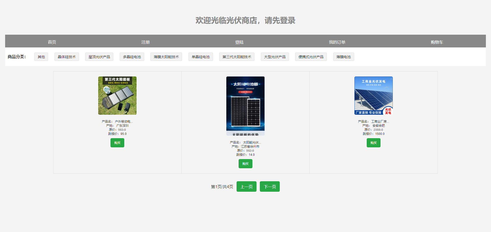
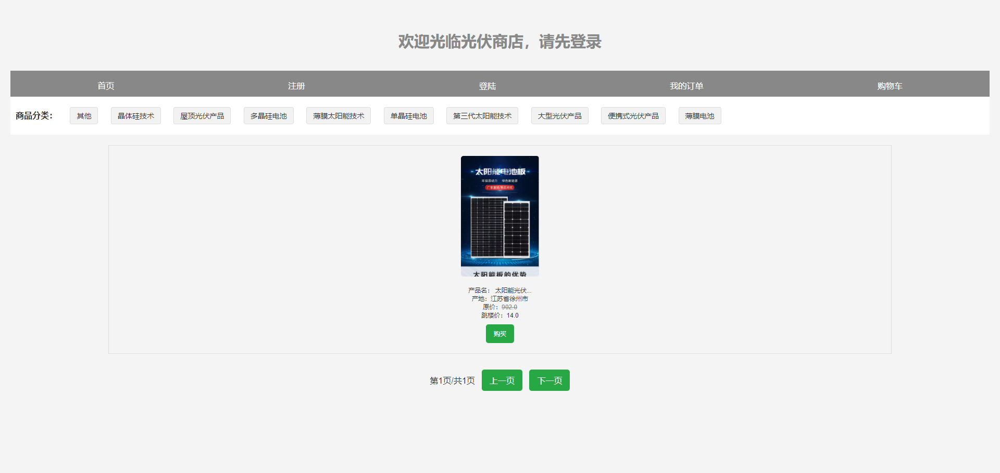
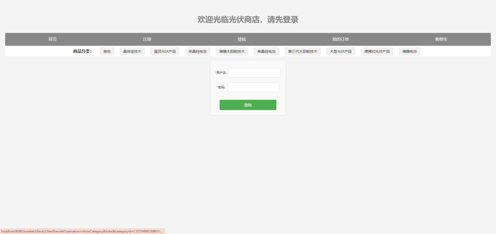
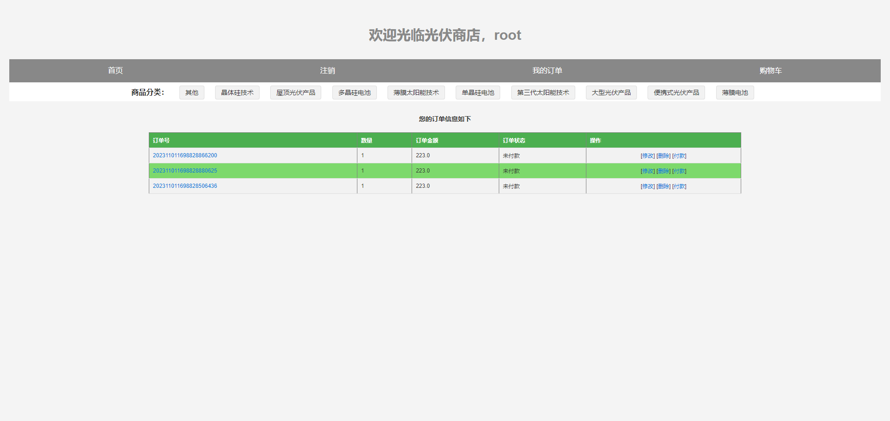
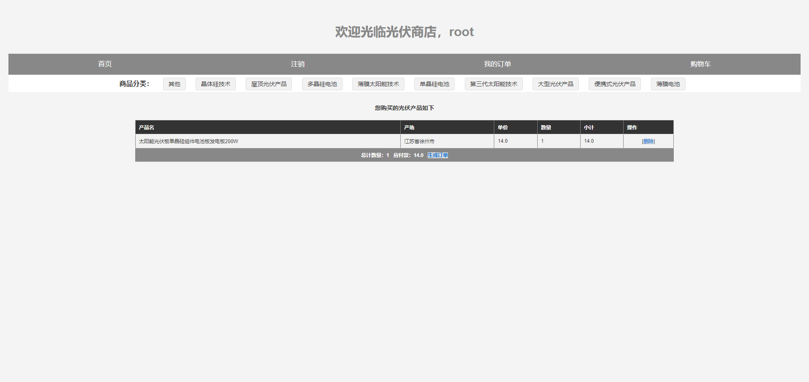
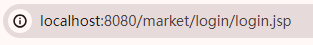
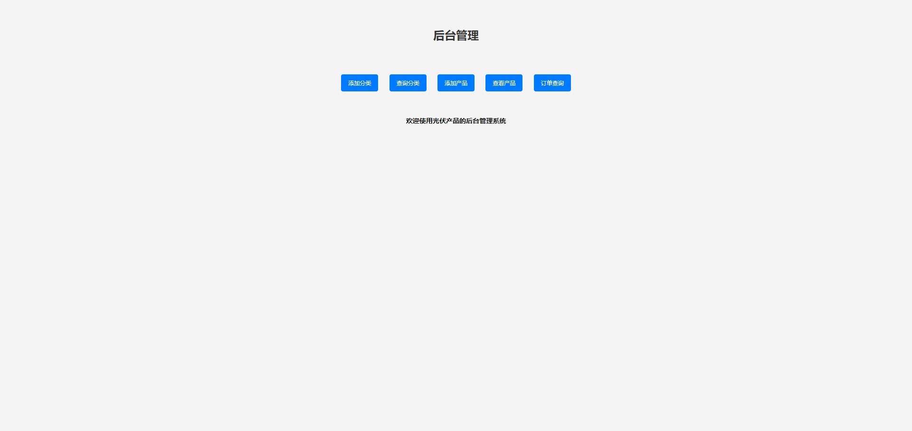
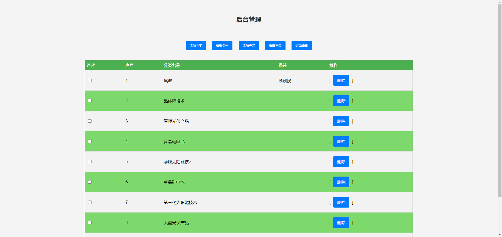
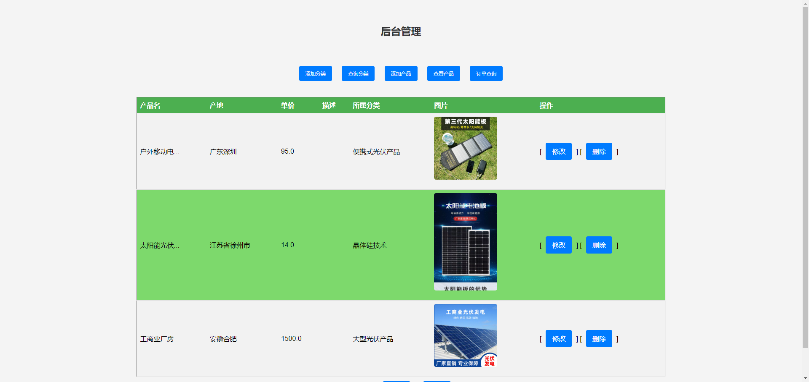
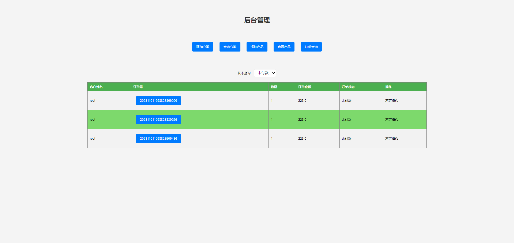

# shopping
简单的 javaWeb 项目(网店销售商城)

这只是一个简单的示例，你可以自己添加更多其他的功能，也可以美化一下这些页面。当然，应付一下老师应该还是勉强可以的。

#  使用方法

把 day19.sql导入到你的MySQL中，然后修改一下javaweb中的数据库配置，然后使用IDEA把这个项目导入就可以了。

## 销售商城核心功能

#### 一、前台页面

1、默认主页：

a、显示某一类的商品分页

b、注册和登录(你可以使用 root - root)

c、我的订单：查看当前用户自己的订单

d、购物车：查看购买的商品

#### 二后台管理

访问这个网站： 

其实就是访问login/login.jsp，看你自己的情况，不一定是这个URL。

同样也是 root - root 登录

1、需要权限管理

2、分类管理

3、产品管理：查询分页

4、订单管理

